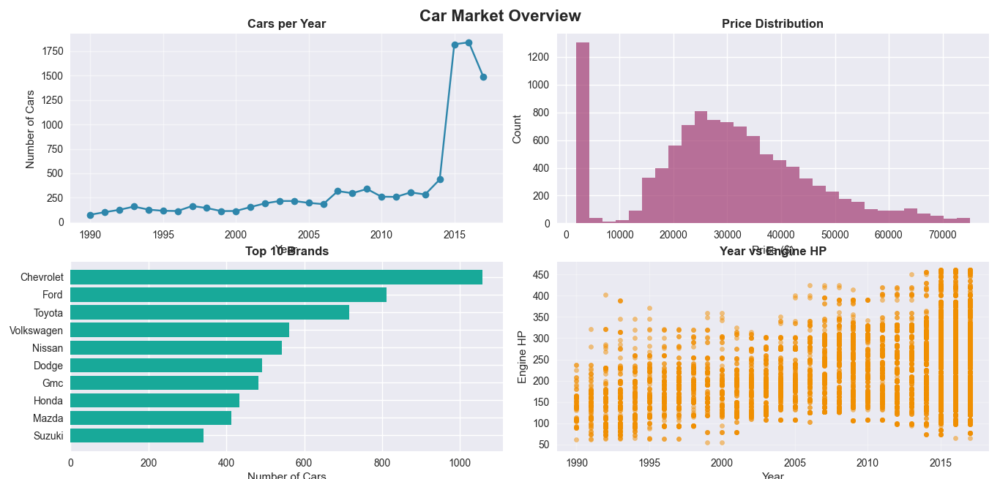
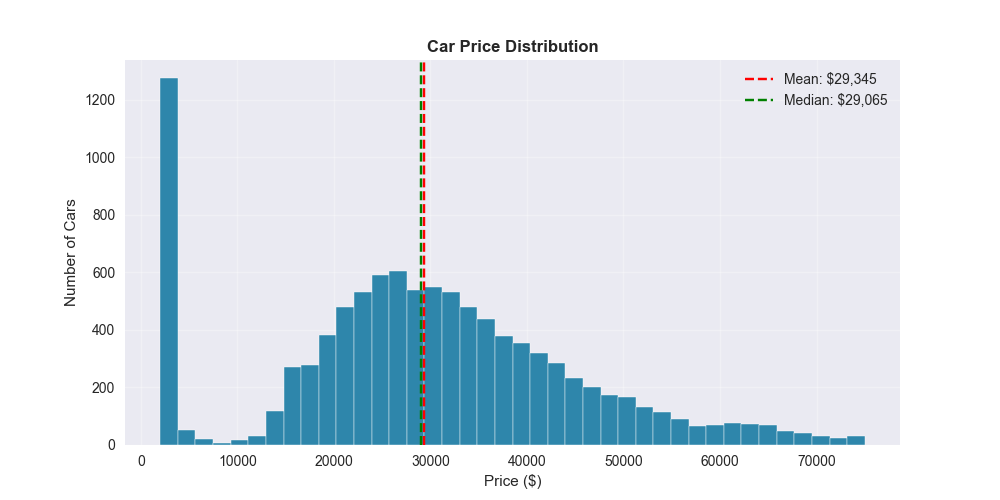
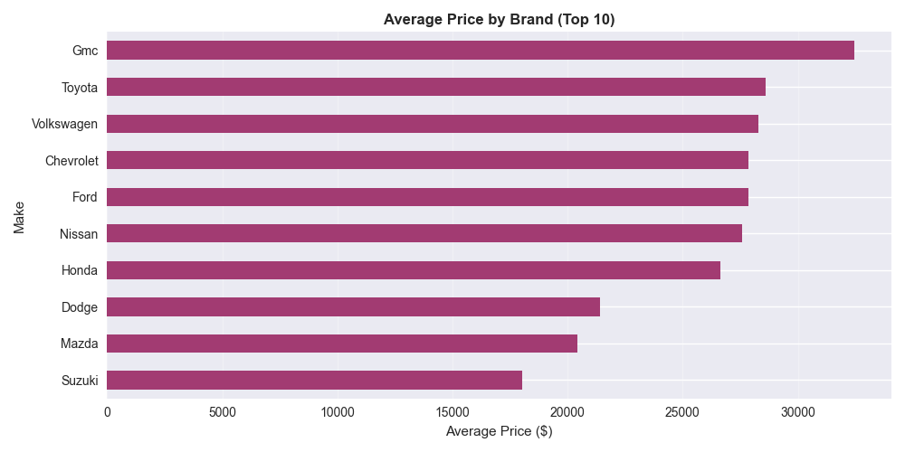
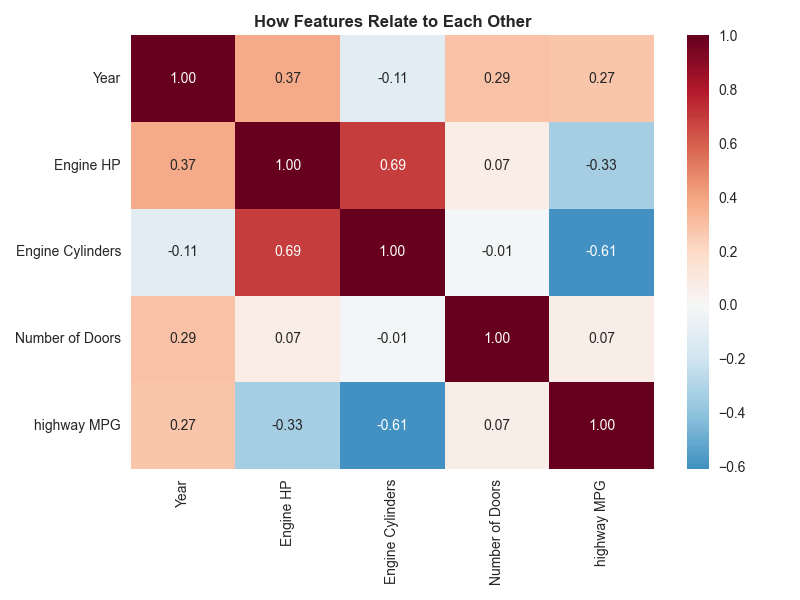

# 🚗 Car Market Analysis & Price Prediction

[](https://www.python.org/)
[](https://pandas.pydata.org/)
[](https://scikit-learn.org/)
[](https://xgboost.readthedocs.io/)
[](LICENSE)

## 📊 Project Overview

This project performs a comprehensive analysis of the automotive market using a dataset of **10,177 vehicles** spanning **27 years (1990-2017)**. The analysis reveals key insights into pricing trends, brand positioning, and feature relationships. Additionally, machine learning models are implemented to predict vehicle prices based on technical specifications.

**Key Questions Addressed:**
- How has the car market evolved over time?
- What factors influence vehicle pricing?
- Which brands dominate different market segments?
- How do technical features correlate with price and efficiency?
- Can we accurately predict car prices using machine learning?

---

## 📈 Key Findings

| Finding | Insight |
|---------|---------|
| **Market Growth** | 200% increase in models available (1990-2017) |
| **Price Distribution** | 75% of vehicles priced under $45K (median: $30K) |
| **Brand Leadership** | BMW, Chevrolet, Mercedes-Benz top by volume |
| **Price-Feature Correlation** | Engine HP and price: r = 0.67 |
| **Performance Trade-off** | Engine HP and MPG: r = -0.57 |
| **Best ML Model** | XGBoost (R² = 0.949, RMSE = $3,621) |

---

## 🛠️ Tools & Technologies

- **Python 3.9+** - Core programming language
- **pandas** - Data manipulation and analysis
- **matplotlib** - Static visualizations
- **seaborn** - Statistical visualizations
- **scikit-learn** - Machine learning models
- **XGBoost** - Gradient boosting for price prediction
- **Jupyter Notebook** - Interactive analysis environment

---

## 📁 Dataset Information

**Source:** Kaggle - Car Features and MSRP Dataset

**Size:** 10,177 vehicles, 18 features

**Features:**
- **Categorical:** Make, Model, Engine Fuel Type, Transmission Type, Driven_Wheels, Market Category, Vehicle Size, Vehicle Style
- **Numerical:** Engine HP, Engine Cylinders, highway MPG, city mpg, Year, Popularity, MSRP
- **Derived:** Avg MPG, Price Category

---

## 🧹 Data Cleaning Process

1. **Missing Values:** Numeric → median imputation, Categorical → 'Unknown'
2. **Duplicates:** 715 duplicate records removed
3. **Outliers:** IQR method applied to MSRP and Engine HP
4. **Feature Engineering:** Created Avg MPG and Price Category features

---

## 📊 Visualizations

### Figure 1: Market Overview Dashboard

*Four-panel overview of market trends, price distribution, top brands, and feature relationships*

### Figure 2: Price Distribution

*Histogram with mean/median lines showing right-skewed distribution*

### Figure 3: Brand Analysis

*Top 10 brands with average price comparison*

### Figure 4: Feature Correlations

*Heatmap revealing key relationships between numerical features*

---

## 🤖 Machine Learning Models

Three models were trained to predict vehicle prices:

| Model | RMSE ($) | R² Score | MAE ($) |
|-------|----------|----------|---------|
| Random Forest | 3,813 | 0.944 | 2,661 |
| Linear Regression | 8,186 | 0.740 | 6,364 |
| **XGBoost** | **3,621** | **0.949** | **2,541** |

**Best Model:** XGBoost achieves 94.9% accuracy in predicting car prices.

---

## 🚀 How to Run This Project

### Prerequisites
```bash
pip install -r requirements.txt
